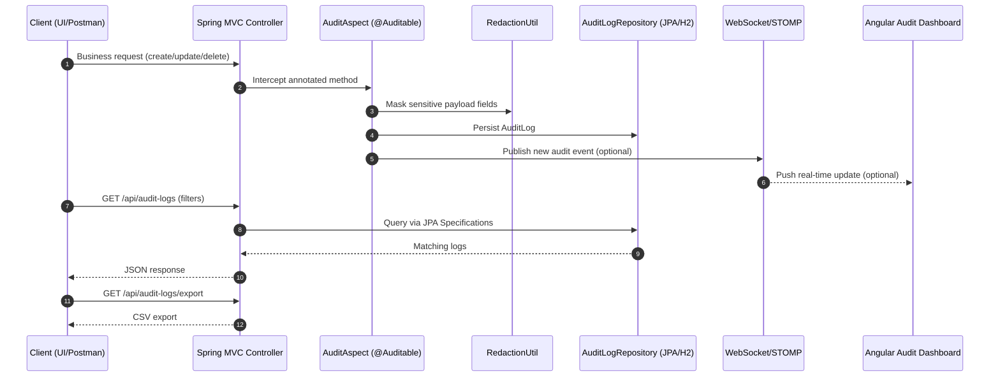

# Architecture Overview

## System Snapshot

```mermaid
flowchart LR
  A[Client<br/>Browser / Postman] --> B[Spring Boot API]
  B --> C[@Auditable + AuditAspect]
  C --> D[RedactionUtil]
  C --> E[(H2 / JPA AuditLog)]
  C --> F[WebSocket STOMP<br/>/topic/audit-logs]
  A --> G[Angular Audit Dashboard]
  G --> B
  F --> G
```

## Core Request Lifecycle



## Component Map

| Layer | Component | Responsibility |
|---|---|---|
| API | `DemoOrderController`, `AuditLogController` | Business actions + audit query/export endpoints |
| Cross-cutting | `@Auditable`, `AuditAspect` | Automatic audit capture after successful operations |
| Privacy | `RedactionUtil` | Redacts secrets before persistence/export visibility |
| Persistence | `AuditLog`, `AuditLogRepository`, `AuditLogSpecs` | Audit entity model + dynamic filtered retrieval |
| Identity extraction | `IdExtractor`, `EntityIdExtractor`, `ReflectionIdExtractor` | Pluggable entity-id resolution from args/results |
| Security | `SecurityConfig` | HTTP Basic + role checks (`ADMIN`, `AUDITOR`, `USER`) |
| Real-time | `WebSocketConfig`, STOMP topic | Broadcast latest audit events to dashboard clients |
| Frontend | `audit-log.component.*`, `audit-log.service.ts` | Search/filter/export UI + live updates |

## Data Model (AuditLog)

| Field | Purpose |
|---|---|
| `username` | Who performed the action |
| `action` | What operation happened |
| `timestamp` | When it happened |
| `entityType`, `entityId` | Which resource was touched |
| `details` | Masked request/response details |
| `userIp`, `userAgent` | Request origin metadata |

## Deployment View

- Local backend: Spring Boot on `:8080`
- Demo UI (docker-compose): static UI on `:8088`
- Cloud Run: backend + built-in static demo UI at service root
- Real-time channel: STOMP topic `/topic/audit-logs` via endpoint `/ws-audit`

## Design Choices

- Annotation + AOP keeps audit logic centralized and non-invasive.
- Specification pattern enables composable filters (`user`, `action`, `from`, `to`).
- Redaction occurs before persistence to avoid sensitive data at rest.
- Role-based access prevents normal users from querying/exporting audit trails.
- WebSocket updates are additive: system remains functional without live streaming.
